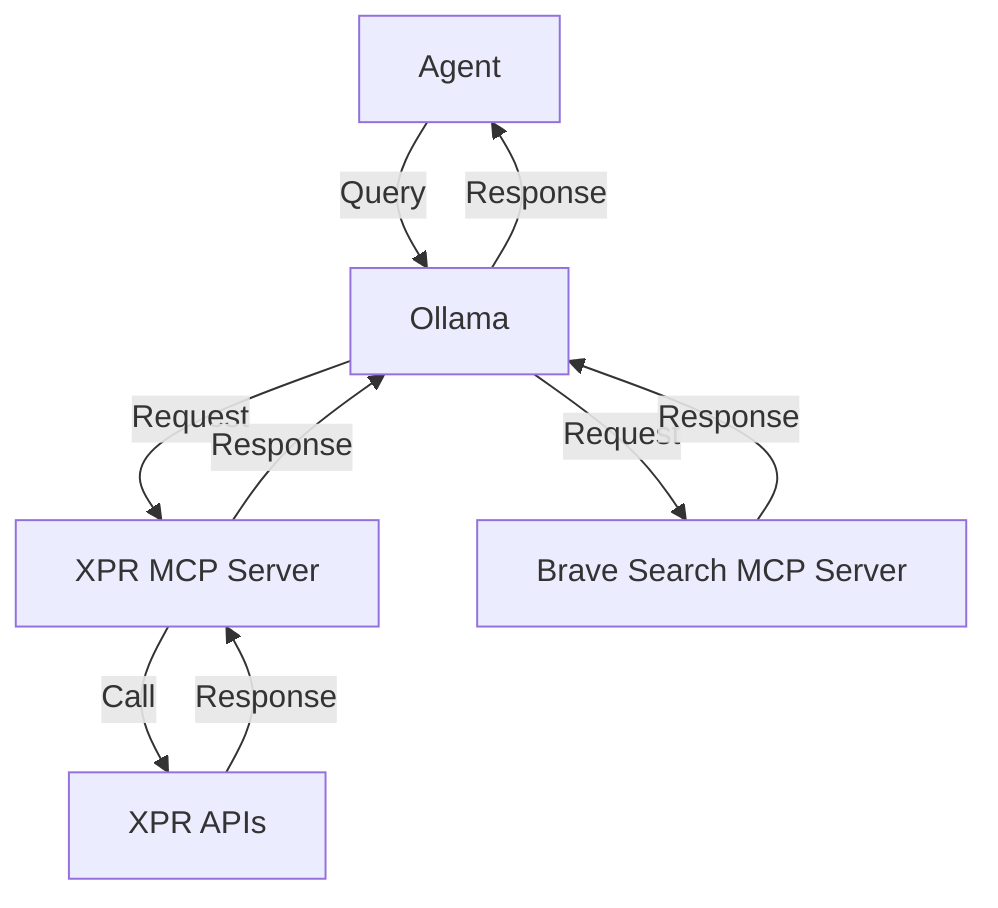

# XprChatUsingMcp
This is a simple CLI chat application which uses local Ollama and multiple MCP servers. 

## Getting started

### Prerequisites
- .Net 9.x
- Ollama
- `llama3.2:3b` Ollama model
- A Brave Search API key
- Docker (used for a local version of the Search MCP server)
- The MCP server for XPR Network access (TODO)

### Running
- Set environment variables
- Set path to xpr-mcp server
- On command line `dotnet run`

### Troubleshooting
- If the server seems to be frozen with no output, confirm that environment variables are set appropriately
- You can test whether MCP servers are runnable by Ollama by using the MCP Inspector and testing the UI:
`npx @modelcontextprotocol/inspector node /path/to/xpr-mcp-server/dist/index.js`
`npx @modelcontextprotocol/inspector docker run -i --rm -e BRAVE_API_KEY mcp/brave-search`
- Uncomment logging on the ChatClientBuilder
`    //.UseLogging(factory) // Logging, uncomment if you need to debug`

## sample prompts

1. Check the XBTC balance for the account identified by squdgy. If the USD value is greater than 20 dollars, write me a poem about cryptocurrency. If the USD value is less than or equal to 20 dollars then insult the account.

2. Check the XPR balance for the paul account and if the USD value is greater than 20 dollars, write me a poem about cryptocurrency. If the USD value is less than or equal to 20 dollars then insult the account.

